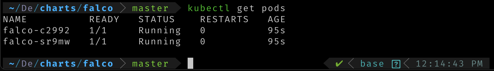
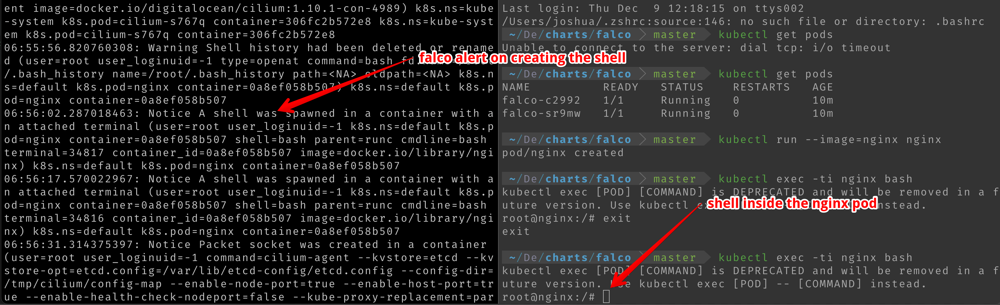

## Introduction
Hello Friends 👋 , hope everyone doing well. In this blog we are going to see how t deploy a security and compliance system using [Falco](https://falco.org/)  in the Digital Ocean as part of [DigitalOcean Kubernetes Challenge](https://www.digitalocean.com/community/pages/kubernetes-challenge)


## Pre-requisite 

- [Digital Ocean Account](https://cloud.digitalocean.com/)
- [kubectl](https://kubernetes.io/docs/tasks/tools/) cli tool to interact with the kubernetes
- [helm](https://helm.sh/docs/intro/install/) to deploy the falco 

### Creating the cluster

Digital Ocean offers the managed Kubernetes service so we don't have to manage the underlying infrastructure. 

* Step 1: Create the simple kubernetes cluster

* Step 2: Download the kubeconfig file and put it under `.kube` folder 

* Step 3: Execute the below command to make sure all nodes in running state 

```
kubectl get nodes
```

> Once the node in running state move to the next step 

### Installing the Falco

* Update the helm

```
helm repo add falcosecurity https://falcosecurity.github.io/charts
helm repo update
```
* Install the falco 

```
helm install falco falcosecurity/falco
```

* Enter the below command to see the pod is in running state 

```
kubectl get pods
```
> Wait for the pod to get created  if the pod is still in creating state




### Creating security event 

* Get the logs of the falco pod using the below command 

```
kubectl logs -f <falco-pod-name>
```

* Open the new terminal and create the simple nginx pod

```
kubectl run --image=nginx nginx
```

* Get the shell inside the pod using the below command 

```
kubectl exec -ti nginx bash
```

* Now on the first terminal, you will see the alert created by the falco as log 




This is how we can install the falco on the k8 cluster to monitor the security events
### References

1. https://www.digitalocean.com/community/tutorials/an-introduction-to-kubernetes
2. https://developer.ibm.com/tutorials/installing-and-using-sysdig-falco/
3. https://github.com/falcosecurity/charts/tree/master/falco#adding-falcosecurity-repository