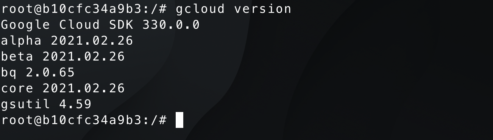
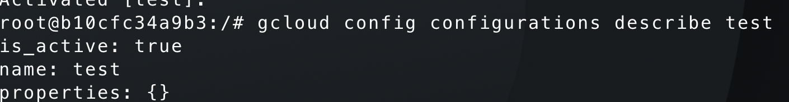

## Introduction

Hello Friends 👋  ,hope everyone doing well .In this blog I am going to share how we can use **Google Cloud SDK** to interact with Google Cloud

## Outcomes

By the end of the article you will be able to get to know  usage of the **Google Cloud SDK**

## Pre-requisite

- Computer with admin rights 
- GCP account(If you don't have one please read my [previous-article](https://www.joshuajebaraj.com/posts/gcp-1/) on how we can set up the GCP account)

## Installing the Google Cloud SDK

For this demo I am going to use Ubuntu operating system, the commands will be same for  the other Operating systems as well. If you are using the other operating system please follow the installation instruction from the [official-guide](https://cloud.google.com/sdk/docs/quickstart)

Type the below command in the terminal  to install the **Google-Cloud SDK**

```
apt-get update 
echo "deb [signed-by=/usr/share/keyrings/cloud.google.gpg] https://packages.cloud.google.com/apt cloud-sdk main" | sudo tee -a /etc/apt/sources.list.d/google-cloud-sdk.list
sudo apt-get install apt-transport-https ca-certificates gnupg curl -y
curl https://packages.cloud.google.com/apt/doc/apt-key.gpg | sudo apt-key --keyring /usr/share/keyrings/cloud.google.gpg add -
sudo apt-get update && sudo apt-get install google-cloud-sdk =y
```

> **Pro tip** You can use docker container instead of installing on the host machine
```
$ docker run --rm -it google/cloud-sdk:latest bash
```

Type the below command in the terminal to verify installation of the Google Cloud SDK
```
$ gcloud version 
```

## Getting Started

Type the below command in the terminal to get authenticate into the google cloud account

```
$ gcloud  init 
```

```
$ gcloud auth list
```

[](image.png)

The above command will show the current account that we are using 

Type the below command in the terminal to see the current configuration of the gcloud account

```
$ gcloud info

```


The above command will show the information like project and where the default configuration files are located

When Installing the Google SDK you will comes installled with other components like gsutil,bg

To see the components currently installed type the below command in the terminal

```
$ gcloud components list
```


To install the certain components for example *minikube* type the below command in the terminal 

```
$ gcloud components install minikube
```

### Creating the customized configuration 
Imagine when are you are working with different projects where you need to have different settings like region,zone for each project ,thats where configuration comes in handy .When we authenticate default configuration  will be created

Type the below command to list the all configurations that are currently present in th system
```
$ gcloud config configurations list
```
> You can find all the configuration in the *.config/gcloud/configurations* directory

To create the custom configuration type the below command in the terminal

```
$ gcloud config configurations  create test
```
The  above command will create the custom configuration named **test**

To see more information about the  configurations that we have created type the below command

```
$ gcloud config configurations describe test
```


The problem with this approach is there is no properties set by default we have to manually configure those properties 

The easiest way to create the configuration is using the gcloud init command

```
$ gcloud init
```

Select the second option 


Next, you will be prompted whether to create the configuration for the new or existing account. Since we are dealing with only a single account select option 1st option


Type the below command to verify the successful creation of the configuration

```
$ gcloud config configurations list
```

To delete the active configurations we have to switch back to other configurations and delete the configurations

```
$ gcloud config configurations activate default
```

Now delete the configurations using the below command

```
$ gcloud config configurations delete test
```

The above command will delete the configuration named test

> Note delete command will not remove the files that we have created In order to purge the configuration file we have to manually delete those files
## Conclusion

Thank you for reading my blog I hope you learned something If you have any comments or feel free out to reach out me on [Twitter](https://twitter.com/joshva_jebaraj) Feel free to check out my other articles at [my-website](https://www.joshuajebaraj.com/posts/)
