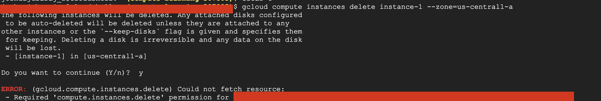

## Introduction

Hello Friends 👋 , hope everyone doing well. In this blog, I am going to share how we can use **OS-Login** to secure the GCP Compute Instance access

## Outcomes

By the end of the article you will be able to get to know  how to use OS-login 

## Pre-requisite

- GCP account with enough permission to create resources

## Why OS login

Imagine some developer in your organization wants to get the SSH access to the Compute Engine for debugging or for some testing purpose.You can do the following 
- Give Instance or Compute Engine admin access But the problem with this developer will also able to create delete stop instances this doesn't follow the principle of the least privilege
- Add the SSH-Keys to the instance  But there is no way to keep tracking and monitoring those keys in the large organization
  
In order to solve those problems, GCP has introduced the **OS-Login** which allows the user only ssh into the instance

## OS Login advantage

- OS Login access are based on the IAM So if you decide the developer no longer need to access those resource want they can simply remove the role associated with the IAM

- OS login allows the user to give sudo permission or allow to login without the Sudo Permission

## How to Enable os Login

Enabling the OS login is the two-step process

### Create the IAM user

Create the Iam user with the below two role


Go to the IAM Page in the GCP and Click **ADD**


Enter the **email-id** of the user you want to give access


Give the user below two permission

```
1. Service account User
2. Compute OS Login
```


> If you want to give sudo access instead of Compute OS Login  give Compute OS admin access

Click **save**

### Creating the Instance with the Metadata

Now we have to add the metadata to the instance to enable the OS login We have two choices

- Adding the metadata  project-wide .This will enable the OS login in  all instance 
- Adding the metadata at the  instance level

For the sake of the article, we are going to add metadata at the instance level

Now go to the Compute Engine Console

> If you are creating the instance using the GUI click the down arrow symbol this will extend the additional options


 
Enter the below value in the **Metadata** section

```
oslogin TRUE
```

 

Click **create**


Now I am switching  to the Developer account  and try to ssh into the instance that we have created previously 


You could see I am  successfully able to ssh into the instance 

 

Now I am trying to delete the instance 

 

You could see I am getting permission denied

We have successfully achieved the Least privilege

Imagine you longer want to give access to the developer you could simply remove the previously assigned role 

Now I am trying to ssh into the instance after role removal

 

You could see permission denied even though I was able to login into the instance previously

This is how we can use OS-login to Secure Compute Engine access


## Conclusion

Thank you for reading my blog I hope you learned something ,If you have any comments or questions feel free to reach out to me on [Twitter](https://twitter.com/joshva_jebaraj) Feel free to check out my other articles at [my-website](https://www.joshuajebaraj.com/posts/)
