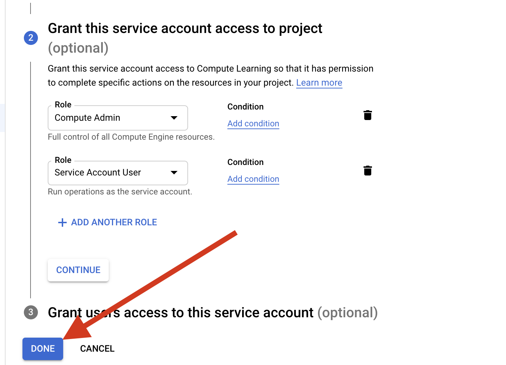
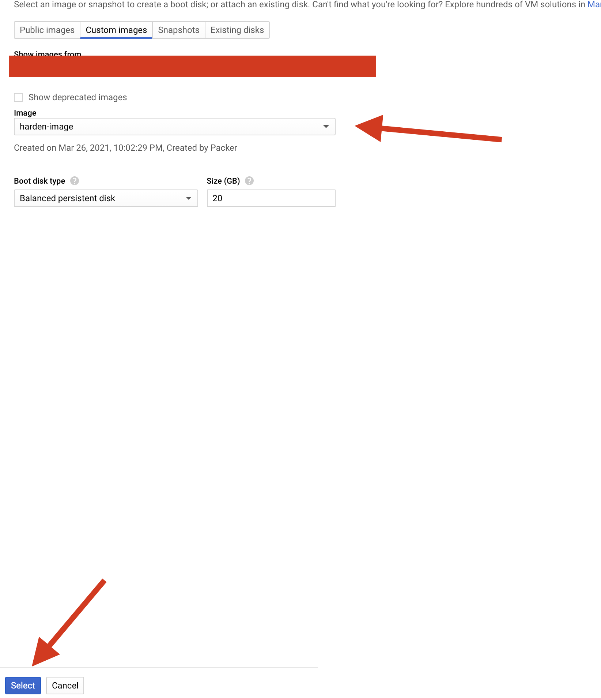

## Introduction
Hello Friends 👋 , hope everyone doing well. In this blog, I am going to share how we can use **Packer** to secure the underlying GCP Compute Instance 

## Pre-requisite

- Packer If you don't have one install it by following the [official-guide](https://www.packer.io/downloads)
- GCP account

## What is Packer and what problem it solves

[Packer](https://www.packer.io/) is the tool that helps to create custom images in an automated fashion. Imagine You want to make sure each instance that you create should have Nginx installed You could go with the following solutions.


- Add the Startup script to the instance so that during the instance creation the startup script will install the necessary stuff
- Custom image where we could create the image baked with all the software and configuration

The first solution is not the efficient way because 
- Every time when the instance is getting created we have to wait until the startup scripts finish the installation 
- Startup scripts are some times prone to error
  
So the second solution may seem efficient one 

Creation of custom images may be  achieved in two ways
- Manually creating the custom Images
- Automating the image creation process

Packer helps to create the custom images in an automated way

Below are the few advantages of the Packer


- Multi Builder option allows building images for multiple cloud providers like Amazon, Google Cloud, azure and even for containers like Docker
- Easily fits into the CI/CD pipelines
- Easy to learn
- Provisioning option which helps to install the necessary stuff


## Achieving security using Packer

Let's see how we can achieve security using Packer. Many people tend to think using the cloud makes us secure by default but it's not true in many cases. Cloud works in the way of shared responsibility, which means there is some level where cloud providers take care of the security where customers have to take care of some security thing

Let's take the example in Compute Instance Google cloud take care of the underlying infrastructure where users take care of the security at the Operating System level. We have to make sure the software installed in the Instance is updated one and configured in a secured way 

Enough of theory lets see in action For the demo I am going to spin up the Simple Compute instance with **Ubuntu** as the base Image with Docker Installed

Now I am running [Docker-CIS-benchmark](https://github.com/docker/docker-bench-security.git) script on the instance that we have created


You could see the script able to find many security flaws and currently, we are getting Score-11 to let's see how we can improve it

## Creating Hardened Image using Packer

Creating Hardened Image is the two step process 
- Create the Service Account
- Build the Image

First, we have to create the Service account with the necessary permission to create the custom Image


Go to the Service account under IAM and Click **CREATE SERVICE ACCOUNT** option 


Enter the Service account name and the description  and Click **create**


Add the  **Compute-admin** and **Service-Account-user** Role to the Service account and click **Done**



Click the created Service-account name on the Service account Page Select the Keys and click **ADD KEY** and click create a new key 


Select the **JSON** option and click **create** 


```
Note: Make sure to store the downloaded key somewhere safe if the key gets compromised the attacker can access the resources in the GCP
```

## Build the custom Image

Clone the repo using the below command

```
$ git clone https://github.com/JOSHUAJEBARAJ/packer-demo.git
```

Now move into the cloned folder 

```
cd packer-demo
```

The folder has three files

|   **Files**	|  **Description** 	|
|---	|---	|
|   build.json	| file containing the detail about the image 	|
|  docker.sh 	| bash  Script to install the Docker  	|
|   harden.sh    | bash Script to harden the docker installation

Replace the below content of the build.json file 

| Field name   | Value                                                  |
|--------------|--------------------------------------------------------|
| Image name   | The image name of the  resultant Image(It should be unique) |
| account file | Name of the Service account file                       |
| Project_id   | Replace the Project ID with your Project ID            |

Now type the below command in the  terminal to validate the packer configuration file

```
$ packer validate build.json
```

Now build the image using the below command
```
$ packer build build.json
```


Now create the instance using the custom image that we created above During creation of the instance change the boot disk of the disk by clicking **change**


Now under custom image  select **harden-image** and click **select**




Now I am again running the Benchmark script on the instance with the customized base Image you could we bumped the score from 11 to 19


This is the simple example that I have shown in the blog you can leverage the provisioner like ansible to create the more secure and custom image of your choice for various builders

## Conclusion

Thank you for reading my blog I hope you learned something ,If you have any comments or questions feel free to reach out to me on [Twitter](https://twitter.com/joshva_jebaraj) Feel free to check out my other articles at [my-website](https://www.joshuajebaraj.com/posts/)


## References

1. https://www.youtube.com/watch?v=lSumUuZT_B8
2. https://www.youtube.com/watch?v=LGwlXBC9TjY
3. https://www.packer.io/docs/builders/googlecompute
4. https://github.com/docker/docker-bench-security