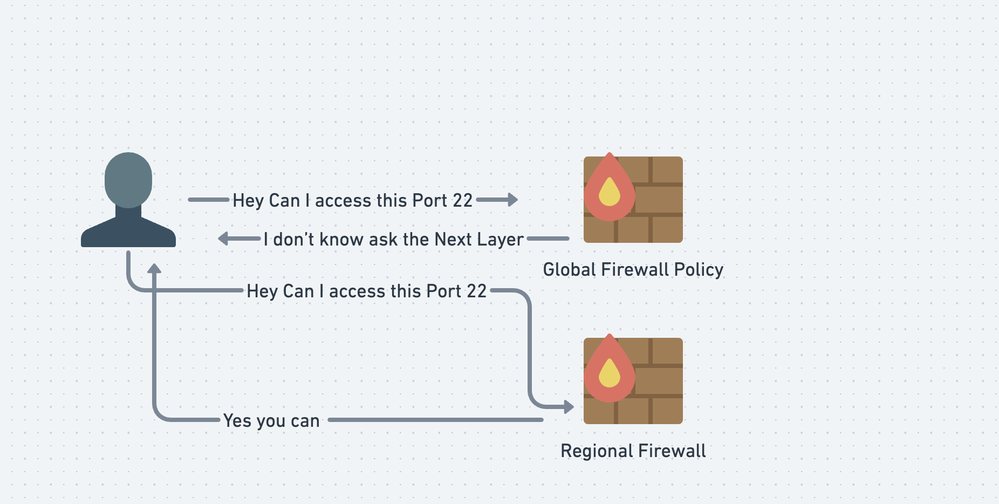

+++
authors = ["Joshua Jebaraj"]
title = "Understanding Firewalls in GCP"
date = "2025-03-13"
description = "In this blog we will learn about firewalls in GCP"
tags = ["GCP", "Security", "Firewall"]
+++

# Firewalls in GCP 
Hey folks! It's been **years** since I wrote a blog. In this post, we will learn about the basics of firewalls in GCP and the various types of firewalls available in the Google Cloud Platform.

## What is a Firewall?

Before we dive in, let's try to understand what a firewall is in the first place. According to Wikipedia:

> In computing, a firewall is a network security system that monitors and controls incoming and outgoing network traffic based on configurable security rules.

To boil it down: **A firewall is essentially a filter for network traffic.**

In GCP we have three types of firewalls 
1. Hierarchical Firewall Policy
2. Network Firewall policy 
3. VPC Firewall rules 


## VPC Firewall rules 

Let's start with the oldest firewall type in GCP which is **VPC Firewall Rules**. As the name indicates, firewall rules are nothing but rules that dictate how traffic flows in the VPC.


Lets try to see some of the important components in the Firewalls


| Component | Description |
|-----------|-------------|
| Direction | Ingress (incoming traffic) and Egress (outgoing traffic) |
| Source/Destination | For ingress rules, specify the source from which traffic is accepted. For egress rules, specify the destination to which traffic is allowed. |
| Protocol and Ports | Specifies which protocol and port the rule is applied to |
| Action on Match | Action to perform when a rule matches; options are deny or allow |
| Priority | Integers assigned to rules; lower numbers indicate higher priority |

Before starting with the hands-on, I want to specify one more thing. In GCP, there are two firewall rules which will be present in all VPC :
- Implicit Egress allow - This means all egress traffic is allowed by default
- Implicit Ingress deny - This means all ingress traffic is denied by default

>Note You can't delete these Implicit rules

You may ask, isn't this a security issue? we don't want egress traffic to be allowed.

Note that the default implicit egress and ingress rules are created with the lowest priority `65535`, so we can override them with our custom firewall rules.

Enough of this theory—let's get started with the hands-on.


First create the Custom VPC using the below command 


```bash
gcloud compute networks create custom-network --subnet-mode=auto
```

By default, when you create a custom VPC, only the two implicit firewall rules will be present. Next create the vm in the custom VPC that we have created

```bash
gcloud compute instances create test-vm \
    --project=<project> \
    --zone=us-central1-c \
    --machine-type=e2-micro \
    --network-interface=network-tier=PREMIUM,stack-type=IPV4_ONLY,subnet=custom-network \
    --provisioning-model=STANDARD \
    --no-service-account \
    --no-scopes
```
> Replace the project Name with your actual project name 

Once the previous step is completed, let's try to SSH into the created VM using the following command:
```
gcloud compute ssh test-vm --zone us-central1-c
```

If this is your first time connecting, the command will generate SSH keys, add them to the project, and configure the VM accordingly.

>Note: During the setup process, press Y for all prompts and leave the options at their default values.

After some time, you may encounter a timeout error. This happens because, by default, ingress traffic is denied in the VPC. To allow SSH access, we need to explicitly allow inbound traffic on port 22.

Lets create the VPC firewall rules to allow ssh connections.

```bash
gcloud compute firewall-rules create ssh-allow --network custom-network --allow tcp:22
```
After running the command, try SSH-ing into the VM again using the same SSH command. This time, you should be able to connect successfully.


> Note the default traffic direction is ingress so we don't need to explicitly specify in the Gcloud Command

### Targets in Firewall Rules 

When creating firewall rules, you must specify the network in which the rules should be created. 
Additionally, you can specify on which instances the rules will apply to. The available options are:
- All instances in the network
- Instances with a specific service account
- Instances with specific tags

## Firewalls Policies

Next, we will discuss Firewall Policies, also known as Network Firewall Policies. A Firewall Policy is essentially a collection of firewall rules, similar to a container for managing multiple rules.

One key advantage of Firewall Policies is that they can be applied to multiple VPCs within a project. This enables centralized management, making it easier to handle hundreds of firewall rules across different VPCs.

In GCP, there are two types of Firewall Policies:

- Global Policies – Applicable to all regions within the VPC.
- Regional Policies – Applicable only to specific regions within the VPC.

Before we proceed with the hands-on exercise, let's delete the previously created SSH rules.

```bash
gcloud compute firewall-rules delete ssh-allow
```

## Key Components of Firewall Policies
| **Component**   | **Description** |
|---------------|---------------|
| **Policies**   | A collection of firewall rules. |
| **Rules**      | The actual firewall rules. These configurations are similar to VPC firewall rules but with some key differences. You can find more details [here](https://cloud.google.com/firewall/docs/network-firewall-policies). |
| **Associations** | Bindings that link firewall policies to specific VPCs. |


In this section we will create the firewall rules which allows the ICMP ingress traffic to be allowed 

Lets get started. First, create a VPC firewall policy to store the firewall rules:


```bash
gcloud compute network-firewall-policies create \
    global-policies \
    --description "This is the global policy" --global
```

Next associate the firewall policy with the custom VPC that we have created previously using association

```bash
gcloud compute network-firewall-policies associations create \
    --firewall-policy global-policies \
    --network custom-network \
    --global-firewall-policy
```

Before creating the rules lets try to ping the VM and see if the ICMP traffic reaches the VM.


Get the external IP of the VM:
```bash
VM1_IP=$(gcloud compute instances describe test-vm --format='get(networkInterfaces[0].accessConfigs[0].natIP)' --zone=us-central1-c)
```

Lets try to ping the VM with its external IP

```
 ping -c3 -W 10 $VM1_IP
 ```

 ```
 3 packets transmitted, 0 received, 100% packet loss, time 2032ms
 ```
 You can see from the output ICMP traffic is currently blocked

Next create the firewall rules to allow ICMP traffic

```bash
gcloud compute network-firewall-policies rules create 1000 \
    --action allow  \
    --description "allow-icmp-traffic" \
     --layer4-configs=icmp \
    --firewall-policy global-policies \
    --global-firewall-policy \
    --src-ip-ranges 0.0.0.0/0 
    
```

Now try to ping vm again

```bash
ping -c3 -W 10 $VM1_IP
```

This time we will be able to successfully ping again. 


At this point, you might wonder why we used firewall policies instead of regular VPC firewall rules.Let's explore some key advantages of firewall policies in the next section.

### Firewall Association 

If you want to attach the same firewall policy to another VPC network, simply run:

```
gcloud compute network-firewall-policies associations create \
    --firewall-policy global-policies \
    --network custom-network \
    --global-firewall-policy
```

With VPC firewall rules, you would need to manually copy the rules to each target VPC, making maintenance a pain since you have to manage multiple copies of the same rules. Using firewall policies simplifies this process by allowing centralized management across multiple VPCs.

### Go_Next

Previously, we saw that VPC firewall rules allow only allow or deny actions. However, Network Firewall Policies support two additional options:

1. apply_security_profile_group:
Intercepts traffic and sends it to a firewall endpoint for Layer 7 inspection.
2. goto_next:
Simply says continue to process the rules in the below level
If this sounds confusing, don't worry! It will make sense once we dive into the hands-on section.


### Regional Firewall policies

Regional Firewall Policies are similar to Global Firewall Policies, but they apply only to specific regions instead of the entire VPC.

Now, let's see how Regional Firewall Policies and the goto_next statement work together.

```bash
gcloud compute network-firewall-policies rules create 2000 \
    --action allow  \
    --description "delegate-ingress-traffic"  \
     --layer4-configs=tcp:22 \
    --firewall-policy global-policies \
    --global-firewall-policy \
    --src-ip-ranges 0.0.0.0/0
```

Basically here what we are doing 




> Note the order in the image is not correct but the concept is same. You can find the correct evaluation order [here](https://cloud.google.com/firewall/docs/firewall-policies-overview#default-rule-evaluation)


Just like Global Firewall Policies, the process for Regional Firewall Policies follows three steps:

-  Create the Policy
- Associate it with a VPC
- Add Firewall Rules


```bash
gcloud compute network-firewall-policies create \
    regional-policy --region=us-central1 \
    --description "Regional network firewall policy with rules that apply to all VMs in us-central1"
```

> In the command above, we explicitly specify the region where the firewall policy will be applied using the --region flag.

```bash
gcloud compute network-firewall-policies associations create \
    --firewall-policy regional-policy \
    --network custom-network \
    --firewall-policy-region=us-central1
```

Next create the firewall rules

```bash
gcloud compute network-firewall-policies rules create 1000 \
    --action allow \
    --firewall-policy regional-policy  \
    --description allow-internal-traffic \
    --direction INGRESS \
    --src-ip-ranges 0.0.0.0/0 \
    --layer4-configs tcp:22 \
    --firewall-policy-region=us-central1 
```

Next, try to SSH into the VM

```
gcloud compute ssh test-vm --zone us-central1-c
```

Now, create another VM in the Asia region and check if SSH access works:

```bash
gcloud compute instances create test-vm-2 \
    --project=<project> \
    --zone=asia-south1-a \
    --machine-type=e2-micro \
    --network-interface=network-tier=PREMIUM,stack-type=IPV4_ONLY,subnet=custom-network \
    --provisioning-model=STANDARD \
    --no-service-account \
    --no-scopes
```

> replace the Project-name with your project name 

Try SSH access to the newly created instance:

```bash
gcloud compute ssh test-vm-2 --zone asia-south1-a
```

You will get an error because the regional policy only applies to the specified region in our case we can only ssh into the instance which is present in the region `us-central1`


Now, check if we can ping the VM:

```bash
VM2_IP=$(gcloud compute instances describe test-vm-2 --format='get(networkInterfaces[0].accessConfigs[0].natIP)' --zone=asia-south1-a)
```


```bash
ping -c3 -W 10 $VM2_IP
```
We will be able to ping the instance because Global Firewall Policies allows the ICMP traffic

## Hierarchical Firewall policy

The last type of firewall we will cover is the Hierarchical Firewall, which allows policies to be assigned at the organization or folder level. This is especially useful in large organizations where firewall rules need to be enforced across multiple projects consistently.

Let's take a scenario where we want to restrict access to `https://www.google.com/` across the entire organization using a Hierarchical Firewall Policy.

Enough of the theory—let’s get started.

> Note: To perform this hands-on exercise, you need a Google Organization Account.

 

First, create the firewall policy using the following command:


```bash
gcloud compute firewall-policies create \
     --organization=<org-id> \
     --short-name="org-firewall-policy" \
     --description="rules that apply to all VMs in the organization"
```
Replace the org id with your org id . You can find the org id using the below command 

```bash
gcloud organizations list
```

Next associate the firewall policy with the org

```bash
gcloud compute firewall-policies associations create \
    --organization=<org-id> \
    --firewall-policy="org-firewall-policy"
```

Next, create a firewall rule to block egress traffic to `https://www.google.com/`.

```bash
gcloud compute firewall-policies rules create 1000 \
    --action=deny \
    --direction=EGRESS \
    --dest-fqdns=www.google.com. \
    --description="block google.com" \
    --layer4-configs all \
    --firewall-policy=org-firewall-policy \
    --organization=<org-id>
```

Now, SSH into the VM:

```
gcloud compute ssh test-vm --zone us-central1-c and try to access the google.com using curl command
```

```bash
curl -m 2 -I www.google.com
```

You will see a timeout error, confirming that the egress firewall rule is blocking traffic to www.google.com.This policy will be applicable to all vms in the organizations regardless of folders, projects , regions and VPCs.

To summarize what we learned 

| **Firewall Type**                 | **Scope**                            | **Description** |
|-----------------------------------|-----------------------------------|----------------|
| **VPC Firewall Rules**            | Single VPC                        | Restricts network traffic within a single VPC. Not recommended unless absolutely necessary. |
| **Global Network Firewall**       | Multiple VPCs (All Regions)      | Restricts network traffic across multiple VPCs in all regions. |
| **Regional Network Firewall**     | Multiple VPCs (Specific Region)  | Restricts network traffic across multiple VPCs within a specific region. |
| **Hierarchical Network Firewall** | Organization / Folder            | Restricts network traffic at the organization or folder level, enforcing policies across multiple projects. |

That's it, folks! I hope you found this blog helpful and learned something new. If you have any feedback or questions, feel free to reach out to me.
### Clean up 

```bash
gcloud compute instances delete test-vm --zone us-central1-c
```

```bash
gcloud compute instances delete test-vm-2 --zone asia-south1-a
```
For firewall policies, I recommend you to go to the UI and delete the resources or if you are lazy like me delete the whole project xD. 