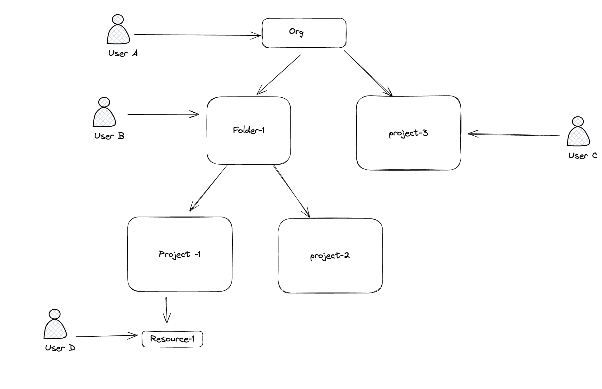

Hey Folks one of the common problem that I have seen people switching from the AWS to GCP is to understand the IAM in GCP. Though most of the concepts are similar there are a quite bit difference in few important concepts. In this blog we will try to understand the IAM in the GCP world what are the things that are similar and what are the things that are different.


> Note This blog is no way a comprehensive guide to the IAM in GCP. This is just a basic guide to understand the concepts of IAM in GCP. If you want to learn more about the IAM in GCP you can find it [here](https://cloud.google.com/iam/docs/overview)

Lets try to understand the basic components which make up the IAM in GCP.

The first component that we are going to see is `Principals`

## Principals

Principals is nothing but an entity that can be granted access to a resources. As of now writing this blog there are 11 types of principals in GCP , it is impossible to cover all the principals in this blog. But we will try to cover the most common principals that we use in GCP.

If you want to learn about all principals you can find it [here](https://cloud.google.com/iam/docs/principals-overview)

- Google Account - Any valid google account we can give access this includes your personal accounts that ends with @gmail.com . This is somewhat similar to the AWS sso users,here the IDP is google(google workspace account if you are using the google workspace)
- Google Group - This is similar to the AWS IAM groups/SSO groups where we can add multiple users to a group and give access to the group.
But the main difference is these groups are maintained outside the GCP.We can create the groups (either inside your organization or outside your organization) and give access to the groups.
- Google Workspace Domain - Here instead of giving access to individual users or groups we can give access to the entire domain. For example lets say you want to give access to all users in the domain `example.com` you can give access to all the users in the domain by simply selecting the domain as principal.
- Google Workspace Identity domain - This is similar to the google workspace domain but here the users don't have the access to other google workspace services like gmail, drive etc. They can only access the GCP resources.
- Service Account - This is a special type of account that is used by the applications to authenticate and authorize the application to access the GCP resources. 

> Note we will be learning more about service accounts in the upcoming sections. But for now think it as a special type of account that is used by the applications to access the GCP resources.

### Other Special Principals

If you folks worked with the Resource based policy you would have known how we can give all users access to the bucket using the  `"Principal": "*"` Similar to the AWS we have two special principals in GCP.
- AllAuthenticatedUsers - This principal represents all the users have valid google account
- AllUsers - This principal represents all the users who are not authenticated to the GCP. This is similar to the `*` principal in the AWS.

> Note similar to AWS these principals are limited to few services like Cloud Storage, BigQuery etc.

### Difference between AWS and GCP in principals

- One of the main difference between AWS and GCP is the way the users are created and managed. In AWS we can create users and give access to the users. But in GCP we can't create users directly in GCP. 
- Static Credentials: For IAM users in AWS we can create access keys and secret keys and use them to authenticate the users(or some times application). But in GCP we can't create static credentials for the users. We have to use the email and password to authenticate the users.

> Note the above two property won't be applicable to the service accounts we will see more about service accounts in the upcoming sections.

## Roles

One of the area where people gets confused is the roles in GCP. In AWS roles are the principal that can be attached to the resources or used by other principals (by assume role) to access the resources. 

In GCP roles are the collection of permissions that can be assigned to the principals .If you want to compare with similar concept in AWS it is similar to the Policies in AWS. 

In GCP we have three types of roles
- Basic Roles - As the name indicates these are basic roles which you can give access to the resources. But the problem with the basic roles is they are too broad. There are three basic Roles in GCP 
    - Owner - which gives full access to the resources
    - Editor - which gives access to modify the resources
    - Viewer - which gives read only access to the resources
> The only thing you have to care about the basic roles is they are too broad and you shouldn't use them anywhere unless its very necessary. Think it of like giving * to the resources and action in the AWS.
- Predefined Roles ; These are the roles which are predefined by the GCP. These roles are more granular than the basic roles. Think it of like a AWS managed policies in AWS
- Custom Roles - These roles are the custom roles which you can create and give access to the resources. You can create a custom role by selecting the permissions that you want to give to the role. Think it of like a custom policy in AWS.

Below is the example of the custom roles

```yaml
title: "My custom role"
description: "My custom role description."
stage: "ALPHA"
includedPermissions:
- storage.buckets.get
- storage.buckets.create
- storage.buckets.delete
```

As you can see in the above example we are creating a custom role which has the permissions to get, create and delete the storage buckets.This will be useful if we want to give granular access to the resources.

## Policies

This is the second most confusing area in GCP IAM. In AWS policies are nothing but a group of permissions that can be attached to the resources or the principals. But in GCP policies are binding between the principals and the roles. 

In GCP there are three types of Policies
1. Allow Policy - Similar to identity policies in AWS 
2. Deny Policy - Similar to Identity policies in AWS(But only difference is here we can deny the access to the resources)
3. PAB policy - Similar to the permission boundary in AWS

But for this blog we will concentrate on the Allow Policy. Similar to AWS in GCP the default is deny unless there is an allow policy attached to the resource.

In GCP we can attach the policies to at the different levels. We will see more about the levels in the upcoming sections.

This is how the sample Policy looks like in GCP

```json
{
  "bindings": [
    {
      "role": "roles/editor",
      "members": [
        "user:joshua@joshuajebaraj.com",
        "group:devs@example.com",
        "serviceAccount:my-app@appspot.gserviceaccount.com"
      ]
    },
    {
      "role": "roles/viewer",
      "members": ["user:joshua@gmail.com.com"]
    }
  ]
}
```

In the above example we assigned the Editor role to the user `joshua@joshuajebaraj.com` and the group and the service accounts. We also assigned the viewer role to the user `joshua@gmail.com`. This is how we can attach the roles to the principals.

### Organization, Folder and Project Level Policies

In GCP we have three constructs for the organizations 
- Organization Level - This is the top level of the hierarchy where we can create the projects and folders. The policies that are attached at the organization level will be inherited by the projects and the folders.
- Folder Level - This is the second level of the hierarchy where we can create the projects and folders. The policies that are attached at the folder level will be inherited by the projects and the folders.
- Project Level - In GCP the project is the smallest unit of the hierarchy. The policies that are attached at the project level will be inherited by the resources in the project.


| **Term**       | **AWS Equivalent**     |
|----------------|-----------------------|
| Organization   | Root OU in AWS        |
| Folder         | OU in AWS             |
| Project        | AWS account in AWS    |




Lets try to understand the policy inheritance in the GCP with the above diagram 

- Here the user A will have access to all projects and folders that are are present in the organization since we attach the policy at the org level 
- The user B will have access to the folder 1 and the project 1 and 2 and every resources under folder 1 
- The user C will have access to the project 3 and the resources under the project 3
- The user D will have only access to the resource-1 

> Note the access inheritance is from top to bottom. If you attach a policy at the org level it will be inherited by the projects and the folders. If you attach a policy at the folder level it will be inherited by the projects and the folders in the folder. Not the other way around.

### Characteristics of GCP IAM Policy 
- The important characteristic of the GCP IAM is the inheritance. The policies that are attached at the higher level will be inherited by the lower level. For example if you attach a policy at the organization level it will be inherited by the projects and the folders. If you attach a policy at the folder level it will be inherited by the projects and folders in the folder.

- Similar to AWS we can also have few resources in GCP which allows to assign permission at the resources level like the bucket level(Think it of like Resource based policy in AWS)

- Another similarity in the GCP and AWS is the IAM conditions. In GCP we can also have conditions in the policies. This allows us to achieve Attribute based access control in GCP.

Example of IAM condition in GCP

```json

{
  "members": [
    "user:joshuajebaraj.z@gmail.com"
  ],
  "role": "roles/bigquery.dataViewer",
  "condition": {
    "title": "Duration_3_months",
    "description": "Expires in 3 months on 2025-06-20",
    "expression": "request.time > timestamp(\"2025-03-20T00:00:00.000Z\") && request.time < timestamp(\"2025-06-20T00:00:00.000Z\")"
  }
}
```

Here wer are telling the user `joshuajebaraj.z@gmail.com` will have access to the bigquery dataset only if the request time is between `2025-03-20` and `2025-06-20`. This is how we can use the conditions in the IAM policies.

## Service accounts 
The last component that we are going to see in this blog is the service accounts. 

Service accounts are the special type of accounts that are used by the applications to authenticate and authorize the application to access the GCP resources.

Service account is very different than other type of principals in the GCP. Service account is mainly made for non human identities. Lets try to see some of the unique characteristics of the service accounts.
- Service accounts are the principals that are fully managed by the GCP. We can create the service account in the project and give access to the resources.
- Service accounts can generate the credentials which can be used by the applications to authenticate and authorize the application to access the GCP resources. This is similar to the IAM users access keys and secret keys in the AWS. But the main difference in the service accounts keys are not short lived like the access keys in the AWS roles.

> Note there are many ways to use the service accounts in GCP, its recommended not to create the keys for the service accounts , as the keys are long lived and can be misused. 


This is similar to the roles in AWS in specific characteristics . Lets try to see the couple of characteristics of the service accounts.
- Similar to the AWS roles we can assign it to the resources like virtual machines, kubernetes pods etc.
- Similar to the AWS roles we can impersonate the service accounts (Assume role in AWS) to access the resources.

### Types of service accounts 

There are three types of service accounts in GCP
- Default Service Account - This is the service account that is created by default when we create the the project and enable few services like compute and has editor role attached to it. 
> Remember we told not to use the basic roles unless its very necessary. Since the default service account has editor role attached to it , its recommended not to use the default service account unless its very necessary.
- User Managed Service Account - This is the service account that is created by the user and managed by the user. This is similar to the user created roles in AWS.
- Google Managed Service Account - This is the service account that is managed by the GCP. This is mainly used by the GCP internally to access the resources.This is similar to the service linked roles in AWS.

### Service Account impersonation 

One of the important characteristics of the service accounts is the impersonation. Similar to the AWS roles we can assume the role 
to access the resources. 

Lets say we have a service account in the project example `my-iam-account@my-project.iam.gserviceaccount.com` and we want to access the resources on behalf of the service account. 

In order to impersonate the service account , first we have to give our principal the impersonate access. We can do this by attaching the role `roles/iam.serviceAccountTokenCreator` to the principal on the service account.

Here we are attaching the role at the resource level to the service account. Think it of like the resource based policy in AWS.

```bash
gcloud iam service-accounts add-iam-policy-binding my-iam-account@my-project.iam.gserviceaccount.com --member='user:test-user@gmail.com' --role='roles/iam.serviceAccountTokenCreator'
```

> Note we can assign the permission to the user at the project level too which gives the user the permission to impersonate the service accounts in the project which is dangerous. So to follow the principle of least privilege we have to attach the permission at the resource level.

In aws if we want to allow the assume role , we have to do the following thing 
1. First we have to give the identity sts assume role permission
2. Next in the role trust policy we have to add the principal that can assume the role.

In GCP the both the above steps are combined into one step. Basically we giving the user the permission to impersonate the service account and the principal that can impersonate the service account.


Now Similar to AWS we can impersonate the service account by using the below command

```bash
gcloud storage buckets list --impersonate-service-account=my-iam-account@my-project.iam.gserviceaccount.com
```

Thats it folks I hope you learned something new in this blog. If you have any questions or feedback please let me know and I am planning to write part 2 of this blog where we will see more about the advanced concepts of IAM in GCP.