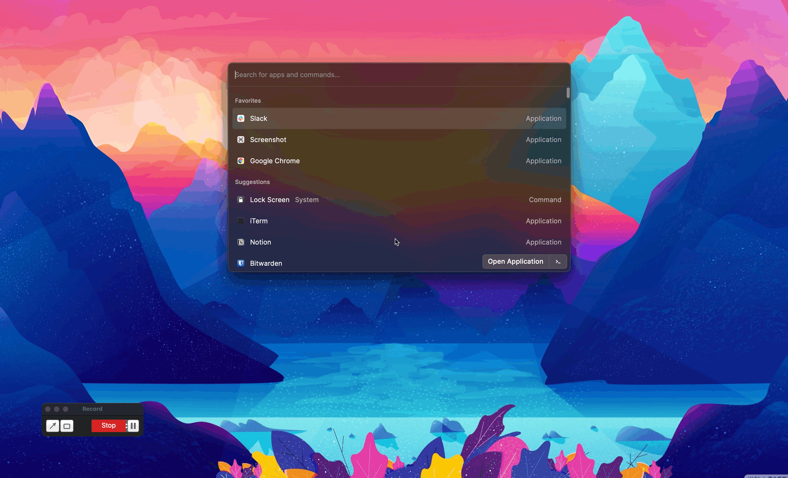

## My Mac Setup 
I have been using a mac as the primary driver for the past year. Being a huge sucker for productivity, I try to optimize my workflow as much as possible. In this blog, I am sharing the tools and tricks that I use to make my workflow easier and more productive(at least that what I think)
​
## Raycast
The default spotlight is very minimal and gets things done, but for nerd for me it is not enough, I have used [alfred]() for the past 7 months. But recently I switched to the [raycast](https://www.raycast.com/). One of the good features about raycast is about the customizability, Basically I have written workflow automation for most of the tasks that I have been doing daily, for example to create the new meet I use the below action 

​
## Package Manager
​
I have been using brew as my package manager for installing the tools. All the tools that I have installed can be backed up using the below command 
​
```bash
brew bundle dump
```

## Windows manager
​
One of the things I hate about mac is there is no native support wm for mac. I have gone overengineering about this one and use three tools for managing the windows in mac, you can probably do it yabai itself, because I am so used to it I am lazy to migrate the changes 
​
| Tool          | use                                                                                                                                                                                                                                                                                                                         |
|---------------|-----------------------------------------------------------------------------------------------------------------------------------------------------------------------------------------------------------------------------------------------------------------------------------------------------------------------------|
| [Slate](https://github.com/jigish/slate)     | This is the first window manager that I have used , it is pretty old and discontinued but still works, I have initially worked to split the windows and move the focus to the application  For example `cmd+shift+c` will shift the focus to the vscode                                                                       |
| [Rectangle](https://rectangleapp.com/) | Configuring slate across multiple monitors become a pain in ass when I started across rectangle, So I have started to using rectangle, to switch between the multiple monitors |
| [Yabai](https://github.com/koekeishiya/yabai)     | One of the features that most windows manager lacks is moving the mouse to the active windows this is a huge headache when you are working with an external monitor, So I have used yabai Simply for moving cursor, even though yabai is powerful that can do the above tasks, I am simply lazy to switch it to completely yabai |

## Terminal 

Most of the work I am doing on my computer requires me to interact with the terminal so I have to try to optimize the workflow as much as possible 

I am using [iterm2](https://iterm2.com/) as my terminal and uses [Oh My Zsh](https://ohmyz.sh/) on top it. It gives me the autocompletion and syntax highlighting features. One of the underrated tools I am using is [zoxide](https://github.com/ajeetdsouza/zoxide). It helps to switch the directory without typing the whole path. I also use git and auto-complete plugin that comes with ohmyzsh
​
## Editor
 I have been using [vscode](https://code.visualstudio.com/) as primary editor for the past 5 years. I have leveraged all the plugins to improve the workflow.
 
 ## Knowledge Management
 
 I have been using [notion](https://notion.so/) for taking notes for the past 2 years, but recently I switched to the [obsidian](https://obsidian.md/) for taking notes. Although I am using Notion for managing the projects and other stuff, I am using obsidian as my primary knowledge base 
 
 ## Misc Tools
 
 **ScreenShot** I  am using [monosnap](https://monosnap.com/) for taking screenshots, one of the good features of this tool is annotation features which I heavily use for writing documentation and blogs
 
**Text-expander** I am using [espanso](https://espanso.org/) for text expander It's pretty useful for filling forms for eg `:twitter` will expand to my twitter handle 


**Stats menu** I am using [stat](https://github.com/exelban/stats) for monitoring my mac resources usage from the menu bar 

I hope you find this blog useful, Let me know what apps you are using in your mac :) 