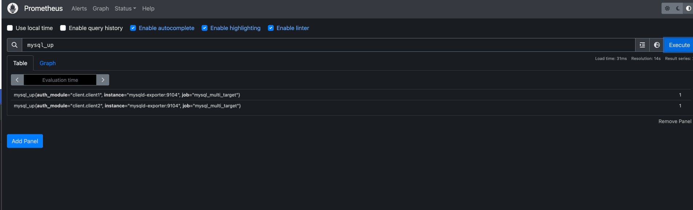

+++
authors = ["Joshua Jebaraj"]
title = "How to setup mysqld prometheus exporter for multiple hosts"
date = "2025-07-20"
description = "In this blog we will learn how to setup mysqld prometheus exporter for multiple hosts"
tags = ["Devops"]
+++


Hello everyone, it's been a while since I wrote a blog  post .I got busy with my work . But now,I am back with a new blog post.

Last month I was working on a project where I need to setup the [mysqld exporter](https://github.com/prometheus/mysqld_exporter) for multiple mysql database. I tried to looking online for any documentation or blogs 
but  I couldn't find any blogs/documentation that explains how to setup the mysqld exporter for multiple hosts. After a lot googling and prompting(begging) with AI I was finally able to get it setup and running.

So I decided to write a blog on how to setup the mysqld exporter for multiple hosts for myself and for others who are looking for the solution.


### Setting up the Database

Before setting up the monitoring system we need something to monitor right .So we are going to setup couple of database servers using docker containers and in order to make the communication between our database and the monitoring system we will be leveraging the docker network.

First lets create the custom docker network where we will be running the database and the monitoring system.

```bash
docker network create mysql-network
```

Next spin up  couple of  database instance as the docker container using the below command 

```bash
docker run -d --network mysql-network --name mysql1 -e MYSQL_ROOT_PASSWORD=super-secret-password -p 3306:3306 mysql
```

```bash
docker run -d --network mysql-network --name mysql2 -e MYSQL_ROOT_PASSWORD=super-secret-password -p 3307:3306 mysql
```

### Setting up the mysqld exporter

Now that we have the database system up and running next step would be setting up the mysqld exporter. Similar to the database we will leverage the docker container to setup the mysqld exporter.

First let's create the configuration file which will be used by the mysqld exporter to connect to the database server.

```bash
[client.client1]
host=mysql:3306
user=root
password=super-secret-password
[client.client2]
host=mysql2:3307
user=root
password=super-secret-password
```
Save the above configuration file as `config.cnf` in the current directory.

Now that we have the configuration file lets create the docker container for the mysqld exporter

```bash
docker run -d \
  --network mysql-network \
  --name mysqld-exporter \
  -p 9104:9104 \
  -v $(pwd)/config.cnf:/.my.cnf \
  prom/mysqld-exporter
```

To verify that mysqld exporter is up and running the mysql exporter is able to connect to the database we can use the curl command to check the status of the exporter

```bash
curl "http://localhost:9104/probe?target=mysql1:3306&auth_module=client.client1"
```

```bash
curl "http://localhost:9104/probe?target=mysql2:3306&auth_module=client.client2"
```

Now that we are done with the setting up exposing the metrics the next step would be setting up the prometheus server to scrape the metrics that are being exported by the mysqld exporter.This is where I got stuck and I couldn't find any documentation on how to setup the prometheus server to scrape the metrics that are being exported by the mysqld exporter.


### Setting up the prometheus server

First we have to create the prometheus.yml file with the below contents. 

```yaml
global:
  scrape_interval: 15s

scrape_configs:
  - job_name: mysql_multi_target
    metrics_path: /probe
    file_sd_configs:
      - files:
          - /etc/prometheus/targets.yml
    relabel_configs:
      - source_labels: [__address__]
        target_label: __param_target
      - source_labels: [auth_module]
        target_label: __param_auth_module
      - target_label: __address__
        replacement: mysqld-exporter:9104
```


Next we have to create the `targets.yml` file which has the list of the database servers that we want to monitor and along with the the authentication module as labels.

```yaml
- labels:
    auth_module: client.client1
  targets:
    - mysql1:3306
- labels:
    auth_module: client.client2
  targets:
    - mysql2:3306
```

Let's try to understand what is happening in the above configuration file.First we are telling the prometheus server to scrape the metrics from the endpoint(Basically this is the endpoint where the mysqld exporter is running)

```yaml
      - target_label: __address__
        replacement: mysqld-exporter:9104
```

our endpoint looks like this this 

```bash
http://mysqld-exporter:9104
```

The below line tells the exporter path to which we need to make the request to get the metrics

```bash
    metrics_path: /probe
```

After adding the url path the endpoint looks like this

```bash
http://mysqld-exporter:9104/probe
```

The below lines tells the exporter to use the `file_sd_configs` to read the targets from the file targets.yml
```yaml
    file_sd_configs:
      - files:
          - /etc/prometheus/targets.yml
```

Our exporter exposes metrics for multiple targets so we have to tell the exporter to which target we want to make the request to get the metrics.In order to do that we are going to use the relabel features of the prometheus where its going to replace the target label with the target parameter for the request.

```yaml
    - source_labels: [__address__]
    target_label: __param_target
```

So now our endpoint looks like this `http://mysqld-exporter:9104?target=mysql1:3306`


Finally we have to specify the auth_module which we have specified in the `targets.yml` file

```yaml
    - source_labels: [auth_module]
      target_label: __param_auth_module
```

This will tell the exporter to use the auth_module label as the auth_module parameter for the request.

So now our endpoint looks like this `http://mysqld-exporter:9104/target=mysql1:3306&auth_module=client.client1`


Now that we have the configuration file lets create the docker container for the prometheus server

```bash
docker run -d \
  --network mysql-network \
  -p 9090:9090 \
  -v $(pwd)/prometheus.yml:/etc/prometheus/prometheus.yml \
  -v $(pwd)/targets.yml:/etc/prometheus/targets.yml \
  prom/prometheus
```

Once you have the prometheus server up and running you can access the prometheus UI at `http://localhost:9090` and you should be able to see the metrics that are being exported by the mysqld exporter by simply executing the following command

```bash
mysql_up
```




That it's folks now we have successfully setup the prometheus server to scrape the metrics that are being exported by the mysqld exporter on multiple targets.I hope you found this blog post helpful.If you have any questions or suggestions please feel free to reach out to me. Thank you for reading.


