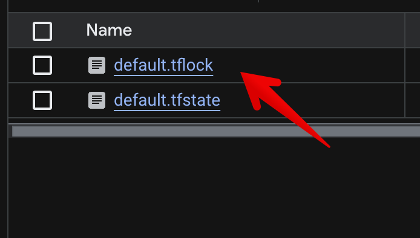

+++
authors = ["Joshua Jebaraj"]
title = "Looking behind the locking in terraform"
date = "2026-05-22"
description = "In this Blog we will see how locking feature works in the terraform"
tags = ["Devops"]
+++


Have you ever wondered what it actually means when Terraform says it's "acquiring a state lock"? Terraform uses the state locking feature to prevent two people from modifying the same state file at the same time. But how does it actually do that? In this post we'll dig into how locking works, especially when we use the GCS backend, where state locking is a first-class citizen.


First create a new file called `main.tf` and fill it with the content below:

```hcl
terraform {
  required_version = ">= 1.5.0 "

  required_providers {
    google = {
      source  = "hashicorp/google"
      version = "~> 5.0"
    }
  }

  backend "gcs" {
    bucket = "<replace-me>"   
    prefix = "locking-demo"
  }
}

provider "google" {
  project = "<replace-me>"
  region  = "us-central1"
}


resource "null_resource" "demo" {
  triggers = {
    always = timestamp()
  }
  provisioner "local-exec" {
    command = "echo hello world"
  }
}
```


Once you have created the Terraform file and updated the bucket name and project,run the following commands:

```bash
terraform init 
terraform apply 
```

Don't approve the changes yet. If you go to the Google Cloud bucket, you'll see that alongside the state file there is another file with the `.tflock` extension.




If we open the lockfile, we'll see the following JSON:

```json
{"ID":"649a5fcc-e7a8-4ed1-92c9-4a3c961dfd2b","Operation":"OperationTypeApply","Info":"","Who":"xxxx@<system-name>","Version":"xxxx","Created":"2026-05-21T12:46:59.32688Z","Path":"gs://xxxx/locking-demo/default.tflock"}
```

Let's understand what each field means:
- ID: A unique ID generated when the lock is acquired.
- Operation: The Terraform operation that acquired the lock (e.g., OperationTypeApply). Locks can also be created during terraform plan using the -lock flag.
- Who: The user and host that acquired the lock (in the form user@hostname).
- Version: The version of the Terraform CLI that acquired the lock.
- Created: Timestamp when the lock was acquired.
- Path: The location of the lock file in the backend.

At first glance this JSON doesn't look special,so how does Terraform actually prevent a race condition? Lets say someone on another 
system tries to apply changes while the lock is held, They'll get the following error:

```
╷
│ Error: Error acquiring the state lock
│
│ Error message: writing "gs://xxxx/locking-demo/default.tflock" failed:
│ googleapi: Error 412: At least one of the pre-conditions you specified did not hold.,
│ conditionNotMet
│ Lock Info:
│   ID:        1779367620657165
│   Path:      gs://xxxx/locking-demo/default.tflock
│   Operation: OperationTypeApply
│   Who:       xxxxxa@xxxxx
│   Version:   xxxxx
│   Created:   2026-05-21 12:46:59.32688 +0000 UTC
│   Info:
│
│
│ Terraform acquires a state lock to protect the state from being written
│ by multiple users at the same time. Please resolve the issue above and try
│ again. For most commands, you can disable locking with the "-lock=false"
│ flag, but this is not recommended.
```

If you look closely, the lock ID in the error message (`1779367620657165`) is not the same as the ID inside the `.tflock` file (`649a5fcc-...`). So what is that number?


## Generation Number

Whenever you upload an object to the Google Cloud bucket, Google Cloud assigns it a *generation number* think of it as a version number for that object. The number you saw in the error message (`1779367620657165`) is the current generation of the `.tflock` object in the bucket.


The trick that Terraform uses is a precondition called `If-Generation-Match`. When you set `--if-generation-match=0`, the write only succeeds if the object doesn't exist. Terraform uses this precondition to atomically create the lock file. If the file already exists, the write fails and Terraform reports `Error acquiring the state lock`.

Let's try this hands-on. Create a dummy file and upload it with the same precondition Terraform uses:

```bash
touch test 
gcloud storage cp test  gs://<bucket-name>/test  --if-generation-match=0
```


Now run the same command again. Because the object already exists (its generation is no longer 0), the precondition fails:
```
Copying file://test to gs://xxxxx/test
⠹ERROR: Task 'gs://xxxx/test#1779372633592817' failed: GcsPreconditionFailedError('')
  Completed files 0/1 | 0B/5.0B
```


Once the apply operation completes successfully, Terraform deletes the `.tflock` object from the GCS bucket. The next `terraform apply` from any developer will then succeed, because the precondition `If-Generation-Match=0` is satisfied againthe object no longer exists.

I hope you learned something new from this post. If you have any questions or feedback, feel free to reach out.


